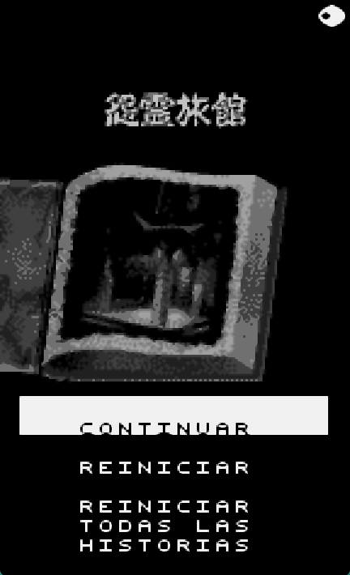
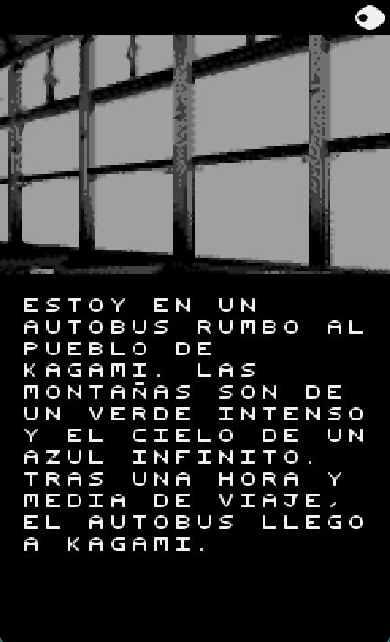
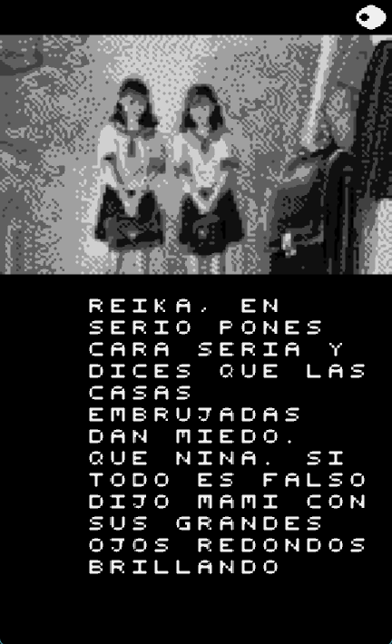
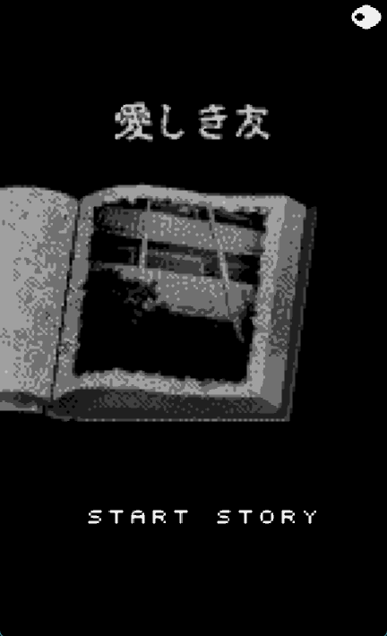
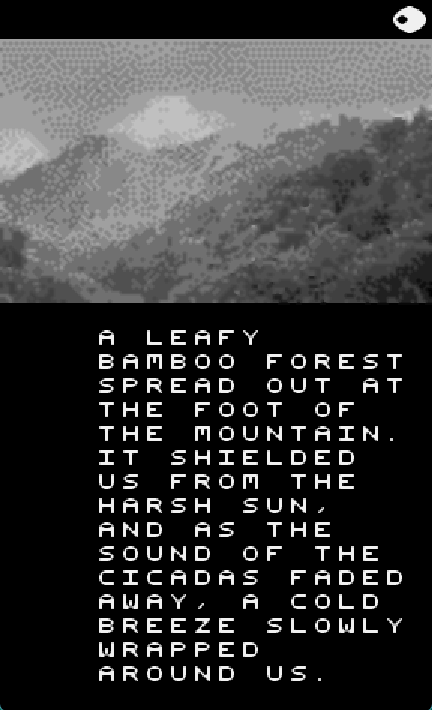
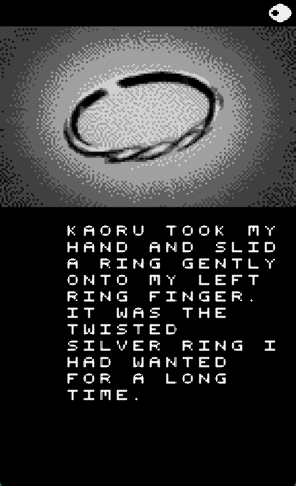

# Terrors (WonderSwan) — Spanish and English Fan Translation

Fan translation of *Terrors*, a Japanese horror visual novel for the Bandai WonderSwan, into **Spanish** and **English**. The game has six branching stories with many endings; all of them are translated in both languages.

**Spanish**

<p>



</p>

**English**

<p>




</p>

> **Version 1.0**
> This repository does **not** contain the game. You need your own copy of the original ROM.

## Playing the translation (patch users)

1. Get the original ROM (4 MB) and check it matches:

   | File | Size | CRC32 | SHA-1 |
   |---|---|---|---|
   | `Terrors (J) [M].ws` | 4,194,304 bytes | `EF5B6B82` | `7148d750f12b5da9a0efd99f5a5a7ccadecbdf60` |

2. Download the `.bps` patch for your language from the [Releases](../../releases) page: `Terrors_ES.bps` (Spanish) or `Terrors_EN.bps` (English).
3. Apply it to the original ROM with any BPS patcher (for example [Flips](https://github.com/Alcaro/Flips) or [Multipatch](https://projects.sappharad.com/tools/multipatch.html)).
4. The result is an 8 MB ROM. Expected checksums:

   | Patch | Result | CRC32 | SHA-1 |
   |---|---|---|---|
   | `Terrors_ES.bps` | Spanish, 8 MB | `B2F559E6` | `db6e39f3102164963a76fff088ce890f03850974` |
   | `Terrors_EN.bps` | English, 8 MB | `95BD7F23` | `1fbddb9438876c6f7987f70272068d82730b15a3` |

The patched ROM is 8 MB because it needs extra space for the translated text. It works in emulators such as Mesen and on real hardware with a flash cartridge that supports 8 MB ROMs.

## Building the ROMs from source

This is only needed if you want to regenerate the ROMs yourself or modify the translation. If you just want to play, use the patches above.

1. **Get this repository** (`git clone https://github.com/Secabel/TerrorsWonderSwan.git`, or "Download ZIP" on GitHub and extract it). It already includes the translation CSVs, the fonts and the generator scripts.
2. **Install the tools:**
   - [Python 3](https://www.python.org/downloads/)
   - [NASM](https://www.nasm.us/) (assembler used by the generators). Make sure `nasm` is in your `PATH`; you can check with `nasm -v`.
3. **Copy your original ROM** into the repository folder, named exactly `Terrors (J) [M].ws` (see the checksums above).
4. **Run, from that folder:**

   ```
   python expand_rom.py       # 4 MB original -> 8 MB Terrors_expanded.ws (intermediate file)
   python build_rom_es.py     # Spanish -> Terrors_ES.ws
   python build_rom_en.py     # English -> Terrors_EN.ws
   ```

The results should match the checksums listed above. Run the commands from the repository root (the folder that contains `data/` and `font/`), with the original ROM in that same folder. The generated ROMs are written there too.

## Repository contents

| File / folder | What it is |
|---|---|
| `data/translation_es.csv` | Spanish translation (one row per screen) |
| `data/translation_en.csv` | English translation |
| `build_rom_es.py` | Builds the Spanish ROM |
| `build_rom_en.py` | Builds the English ROM |
| `expand_rom.py` | Expands the original 4 MB ROM to 8 MB (mirrored); run it first |
| `src/cave_es.asm`, `src/cave_en.asm` | x86 (NASM) assembly of the code injected into the ROM (the "cave"). They are generated by `build_rom_es.py` / `build_rom_en.py` (which then assemble them with NASM); they are included here so the assembly can be read without running the build |
| `font/font_es.bin`, `font/font_en.bin` | Font tile data used by the Spanish and English builds (each build uses only its own) |
| `font/build_font_es.py`, `font/build_font_en.py`, `font/mcufont.h` | Scripts that generate the font files from the mcufont base font (run them from the repository root, e.g. `python font/build_font_es.py`) |
| `lua/capture_screens.lua`, `lua/capture_config.ini` | Mesen Lua script that plays the game by itself and captures every screen (used to find which screens still need translation). Edit the two paths in the `SETTINGS` block at the top of the script before running it |
| `editor-visual/` | Visual editor (React/TypeScript) to preview how translated text fits on screen and to format question screens. **Note:** it does not support question screens with more than two options; those must be packed by hand, see [`docs/three_option_questions.md`](docs/three_option_questions.md) |
| `docs/three_option_questions.md` | Packing algorithm for question screens with three options |
| `japanese-script/` | Original Japanese script (H1–H6), extracted directly from the original ROM: per-story text with cursors and the branching graph (`full_script.csv`), plus a merged Japanese/Spanish/English CSV (`script_jp_es_en.csv`). **Not needed to build the ROM** — kept for anyone who wants to translate the game into another language from the original text instead of the Spanish or English scripts |
| `script-extractor/extract_script.py`, `script-extractor/glyph_table.tsv` | Script and glyph table used to regenerate `japanese-script/` from the original ROM (see below) |

## Regenerating the Japanese script

`japanese-script/` is generated by reading the original ROM directly, without playing the game or doing OCR. To regenerate it:

```
python script-extractor/extract_script.py "Terrors (J) [M].ws" script-extractor/glyph_table.tsv japanese-script
```

Run it from the repository root, with the original ROM there (see the checksums above).

## Known issues

- **Residual kanji on question screens:** on several translated question screens, the last kanji of the original text is drawn after the translated text, so a leftover kanji may sometimes be visible. This is cosmetic and does not affect the game. It may be fixed in a future version.
- **Options (pause) menu not translated:** the in-game options/pause menu is still in Japanese.
- **Untranslated screen after the pause menu:** after opening the options (pause) menu and returning to the game, the current screen is shown untranslated; the translation resumes from the next page.
- With 47 endings and many routes that only change dialogue, not every route has been re-tested after every change. Some typos or inconsistencies may remain.

## Credits

- Translation and ROM hacking: **Talion**.
- Font: based on the *mcufont* 5x5 pixel font by Maurycy ([maurycyz.com/projects/mcufont](https://maurycyz.com/projects/mcufont/)), released as CC0 / public domain, itself based on lcamtuf's `font-inline.h`.
- Tools: [Mesen](https://www.mesen.ca/) emulator, [NASM](https://www.nasm.us/), Python.

## License

The scripts, translation files and visual editor in this repository are released under the [MIT License](LICENSE). The base font (`font/mcufont.h`) is CC0 / public domain. The license does not cover the game itself (see below).

## Legal

This is an unofficial fan project, not affiliated with or endorsed by the original developers or publishers. *Terrors* and all related rights belong to their respective owners. No game data is distributed here: the patches only contain the differences from the original ROM, which you must supply yourself.
